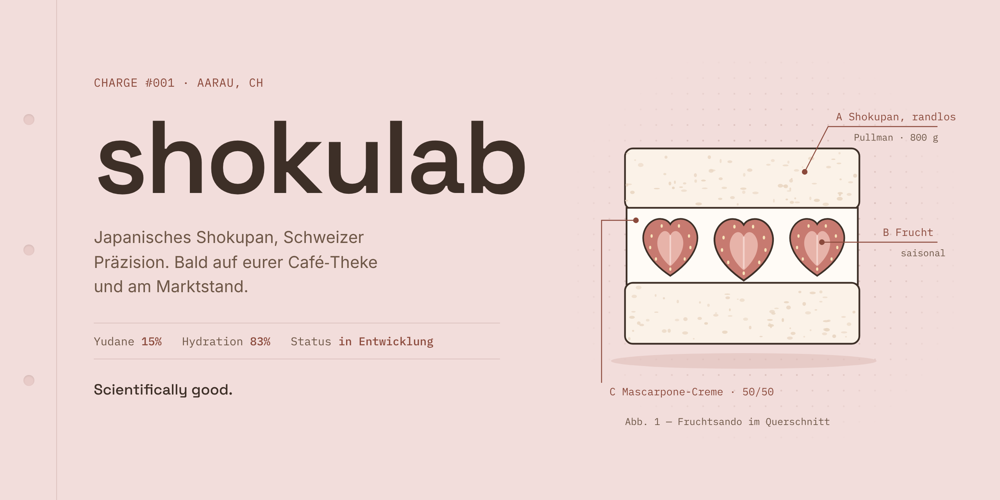
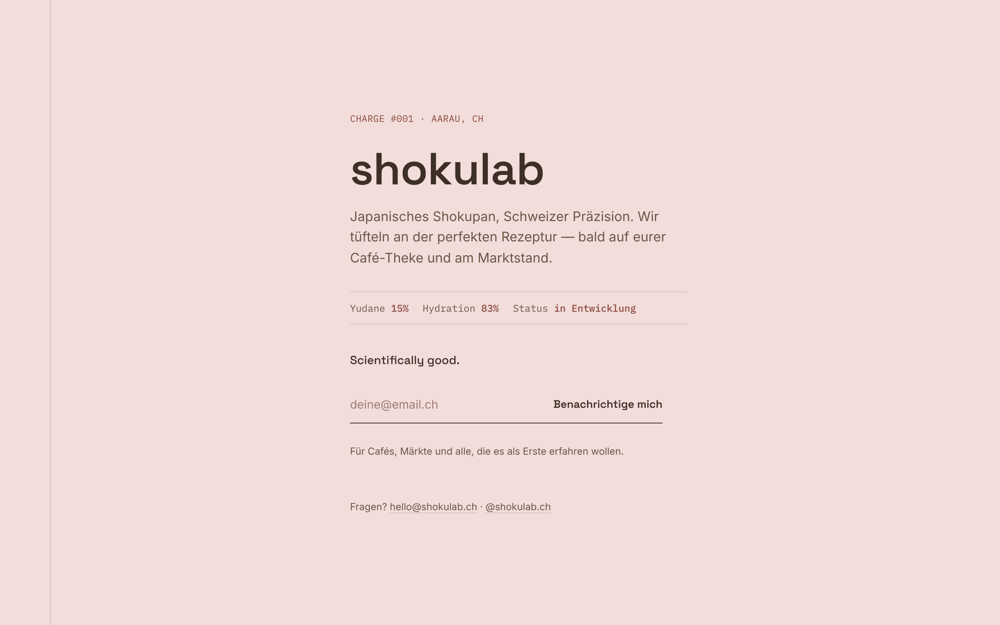
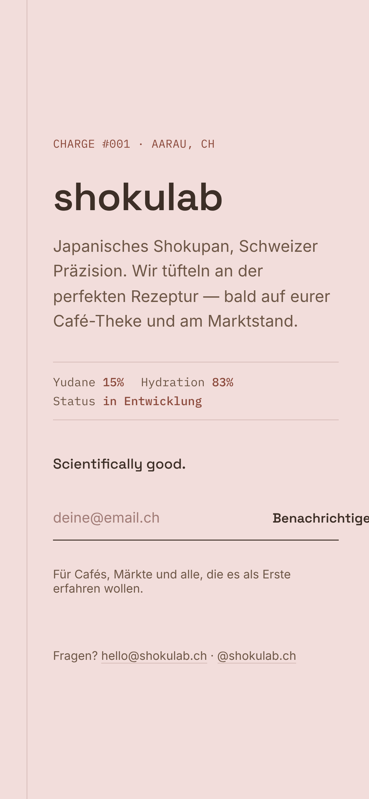

<a href="https://shokulab.ch"></a>

<p>
  <a href="https://shokulab.ch"></a>
  <a href="https://instagram.com/shokulab.ch"></a>
  <a href="mailto:hello@shokulab.ch"></a>
</p>

**Japanisches Shokupan, Schweizer Präzision.** Wir backen Sandos aus fluffigem Milchbrot — randlos, sauber geschnitten, mit Mascarpone-Creme und Frucht der Saison. Bald auf eurer Café-Theke und am Marktstand.

<sub><i>Japanese milk bread, Swiss precision. Crustless shokupan sandos for coffee shops and markets in Switzerland — coming soon.</i></sub>

<br>

### Laborbuch · Charge #001

|                |                                            |
| :------------- | :----------------------------------------- |
| **Yudane**     | `15 %` des Mehls                           |
| **Hydration**  | `83 %`                                     |
| **Form**       | Pullman, mit Deckel gebacken — randlos     |
| **Füllung**    | Mascarpone-Creme `50/50` + saisonale Frucht |
| **Status**     | `in Entwicklung`                           |

Wir ändern pro Backtag eine Variable und schreiben alles auf. Erst wenn die Krume stimmt, geht's raus.

<br>

### Die Seite

<table>
  <tr>
    <td width="74%"><a href="https://shokulab.ch"></a></td>
    <td width="26%"><a href="https://shokulab.ch"></a></td>
  </tr>
</table>

Für Cafés, Märkte und alle, die es als Erste erfahren wollen: **[auf die Warteliste →](https://shokulab.ch)**

<br>

### Wie dieses Repo funktioniert

```text
index.html        →  shokulab.ch   (Cloudflare Pages, kein Build-Schritt)
_headers          →  Sicherheits-Header für Cloudflare Pages
.github/assets/   →  Bilder für dieses README
```

Push auf `main` → in etwa einer Minute live.

<br>

<sub>Gebacken zwischen Aarau und Solothurn · <b>Scientifically good.</b></sub>
